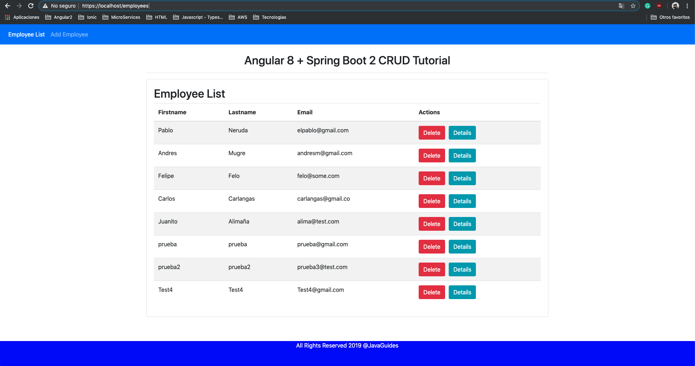
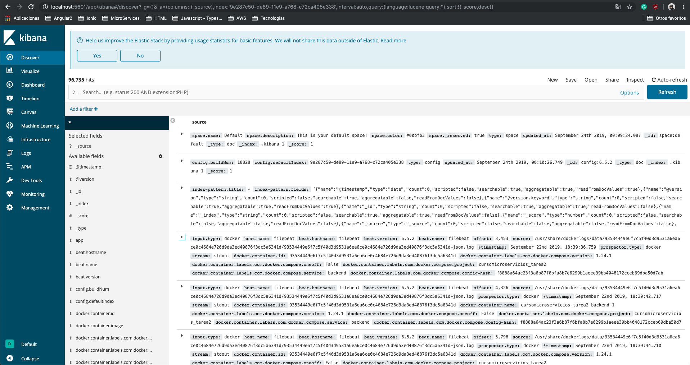
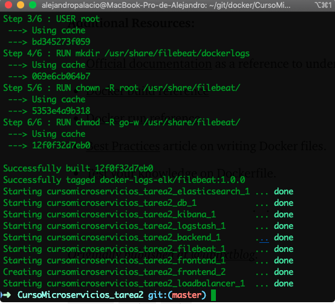
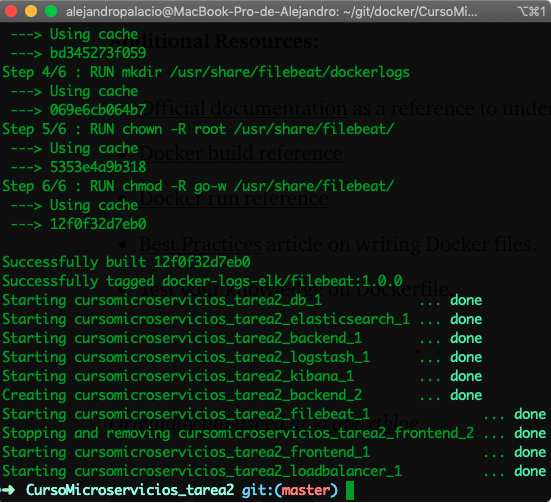

# Evidencias solucion taller 2 - Alejandro Palacio Duque

## Aplicacion en ejecucion con certificado SSL
## Frontend (Angular 8) 
## Backend (Sprint boot 2)
## Base de Datos(Mysql) 

## Logs de Kibana con servicios de docker en ejecución

## Ejecución Docker-compose escalando servicio Frontend

## Ejecución Docker-compose escalando servicio Backend

